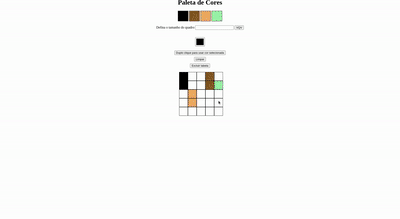

<h1 align="center"> 
  
  
  Projeto Pixels Art 
</h1>

<h2>
📜 Sobre: 
</h2>

- O Pixels Art é um projeto, parte de um bloco de 5 projetos, sendo 3 obrigatórios e 2 bônus, que encerram o bloco 5 de conteúdo da formação em Desenvolvimento de Software da Trybe.

- A premissa do projeto é trabalharmos os conceitos aprendidos até o momento entre <strong>HTML, CSS e JavaScript</strong>. Estruturando o HTML, utilizando CSS para algumas estilizações e JavaScript para manipular elementos HTML e seus estilos.

- Utilizando essas três ferramentas, deveria ser criado um site de colorir pixels, onde exista a cor padrão preta e as outras três opções de cores sejam criadas aleatoriamente conforme a página é recarregada. Também é estipulado que o tamanho minímo do Canvas seja de 5x5 e o tamanho máximo seja de 50x50. E deve ser possível para a pessoa usuária limpar o quadro todo.

<h2>
🚀 Incrementos:
</h2>

- Tenho uma amiga que é artista plástica e amou o projeto, queria muito que eu deixasse ele on logo para que ela pudesse experimentar, porém fiquei pensativo em relação as poucas variedades de cor que o programa oferecia.

- Na busca por uma alternativa que suprisse essa necessidade, inseri um input do tipo color, permitindo que ela explore uma vastidão de cores e selecione a que mais lhe agrade, assim como também podendo selecionar diretamente a cor branca, poderá utilizá-la como um "modo borracha" e apagar apenas alguns quadrados na hora de realizar seus desenhos.

<h2>
🔮 Planos:
</h2>

- Desejo ainda aprimorar mais no futuro, melhorar a forma da seleção de cor no input, acrescentar algumas estilizações e mais para frente refatorar o script.js.

----------

<h1 align="center">

</h1>

---------------

Desenvolvido por © Thiago Pederzolli Machado da Silva!

